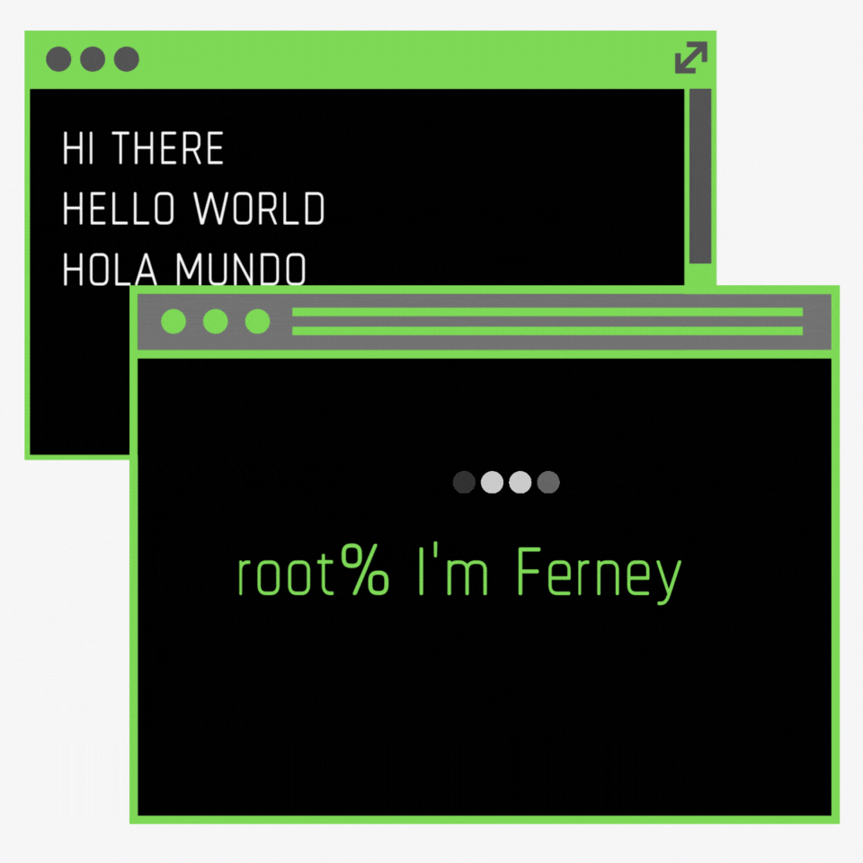

<hr/>

<h2> 👇 Connect with me on 👇</h2>

[](mailto:fvanegash@libertadores.edu.co)

[](mailto:ferneyvanegas@gmail.com)

[](https://linkedin.com/in/ferney-vanegas-hernandez) 

[](https://twitter.com/ferney_vanegas) 

<hr/>


```javascript
// tools_I_use organized
class About extends Me { 
  const myTools = {  
    ProgrammingLanguages : [ "Java", "*Python", "PHP","C++", "C#", "*Javascript", "*Typescript", "Visual Basic"],
    OtherLanguages : [ "HTML", "CSS", "Bash", "Json", "Markdown"],
    Frameworks : ["*Angular", "*Django", "*restframework", "LoopBack", "CodeIgniter", "*Ionic", "*Express", "Flask"],
    IDEs : ["NetBeans", ".Net"],
    Database : {
                    SQL: [ "Mysql", "Mariadb", "Sqlserver"],
                    NoSQL : [ "Firebase", "Mongodb"]
                  },
    SGBD: ["Compass", "PhpMyAdmin", "Azure DataStudio", "SQL Management Tools", "WorkBench"],
    Editors : ["Vscode", "Sublime", "Joe"],
    Tools : {
      modelling : "StarUML",
      design : ["Pixelorama", "Photoshop", "Canva", "FontAwasome"],
      libs : ["Bootstrap", "Phaser"],
      devOps : ["AWS", "Heroku", "FileZilla", "ESXi", "Proxmox", "Cloudflare"],
      env : ["nodejs", "virtualenv", "docker", "docker-compose"],
      security : ["Recaptcha", "Hcaptcha", "Jwt"],
      conection : ["ssh", "anydesk", "no-machine"], 
      more : ["Postman", "Sendgrid"],
    AI : ["Chat-GPT", "Auto-GPT"],
    Versions : ["Git", "GitHub"],
    Platforms : {
                    "GNU/Linux" : ["Debian", "Ubuntu", "Manjaro", "Zorin", "Arch"], 
                    "Windows": ["XP", "7", "8", "10", "11", "Server"]
                }
    }
  };

  const myPreferences = {
    Platform : "Linux", 
    Architectures: ["microservices", "monolithic" "event-driven", "design system pattern", "spa", "pwa"],
    Paradigm: ["POO", "COP"],
    Dev : "Fullstack",
    Agile : "Scrum", 
    Challenge : ["Java SE 8 Cert", "Java EE 7 Back-end Server application Development 2.0 Cert"]
  };

  const languages = {
    default : "spanish",
    more : ["english"]
  }
}
```


