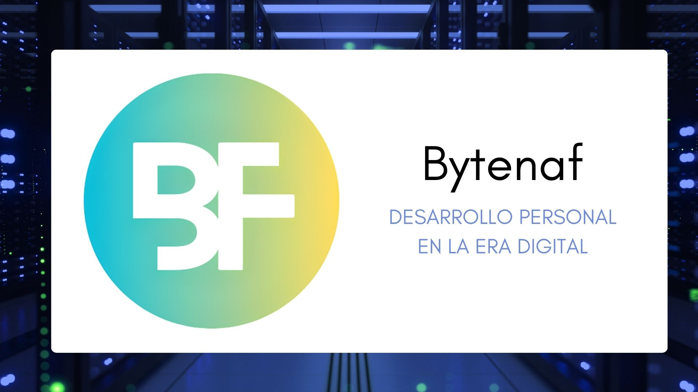

## Find me on👇


[](https://twitter.com/ferney_vanegas)
[](https://www.linkedin.com/in/ferney-vanegas-hernandez/)
[](mailto:ferneyvanegas@gmail.com)


## About me 😎

```javascript
// tools_I_use organized
class About extends Me { 
  const myTools = {  
    programmingLanguages: {
      favorites: ["python", "javaScript", "typeScript"],
      familiarWith: ["java", "php", "C++", "C#", "visualBasic"]
    },

    otherLanguages: ["html", "css", "markdown", "bash", "sql"],

    frameworks: {
      favorites: ["express", "angular", "react", "django"],
      familiarWith: ["loopBack", "codeIgniter", "ionic", "flask"]
    },

    ide: ["netBeans", ".net"],

    database: {
      sgbd: ["mysql", "mariadb", "sqlServer", "mongodb"],
      tools: [
        "phpMyAdmin",
        "azureDataStudio",
        "workBench"
      ],
      noSqlTools: ["firebase", "compass"]
    },

    tools: {
      libs: ["bootstrap", "bulma", "phaser"],
      devOps: ["aws", "heroku", "cloudflare"],
      env: ["nodejs", "virtualenv"],
      standar: ["json", "jwt"],
      container: ["docker", "docker-compose"],
      versions: ["git", "gitHub"]
    },

    ai: ["chatGPT", "bard"],

    platforms: {
      favorite: "linuxArch",
      familiarWith: ["microsoftSystems", "linuxDistributions"]  
    }, 

    architecturesAndTechnologies: {
      favorites: ["microservices", "POO", "spa", "pwa"],
      familiarWith: [
        "monolithic",
        "event-driven",
        "design system pattern"
      ]
    },

    dev: "fullstack",

    agile: "scrum",

    languages: {
      default: "spanish",
      more: ["english"]
    }
  };
}
```
## Projects 💻

<a href="https://bytenaf.com">
  
</a>